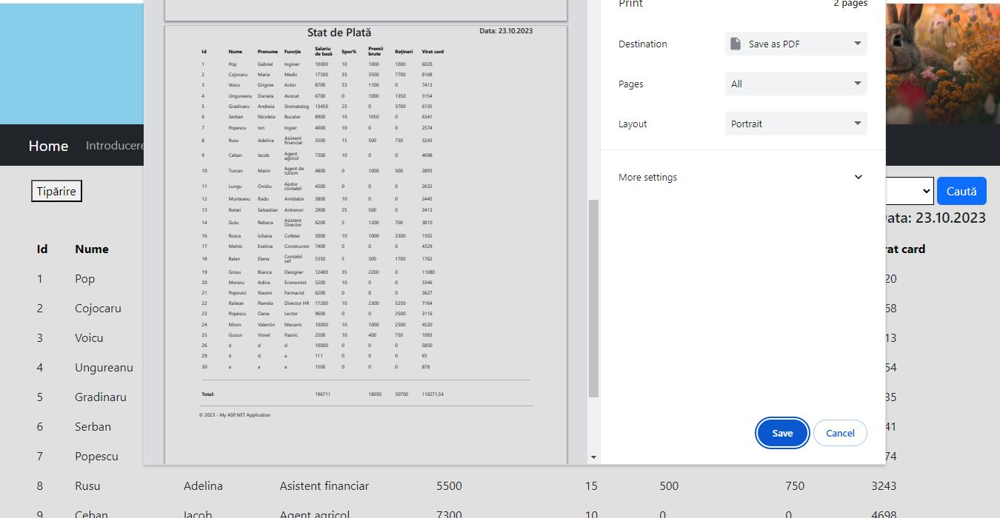
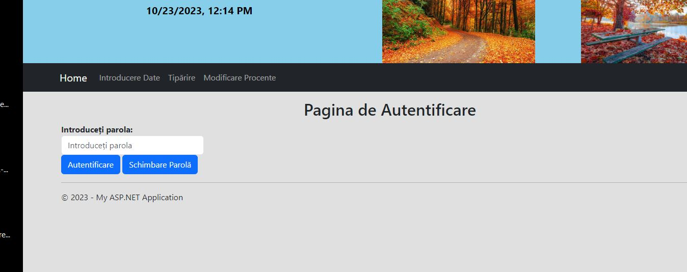
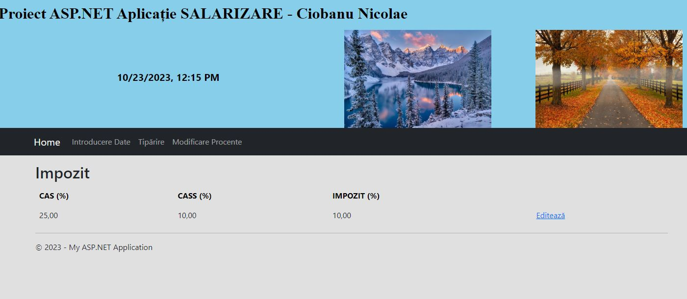

# WebPayrollSystem-ASP.NET

WebPayrollSystem este o aplicație web ASP.NET destinată calculului salariilor într-o firmă.

# Adăugare angajat 

# Date despre angajați

# Detalii despre un anumit angajat

# Flururași de salariu

# Tipărirea în format PDF a statelor de plată pentru toți angajații

# Pagina de autentificare pentru a putea modifica %CASS, %CAS și %Impozit

# Modificare Impozite

